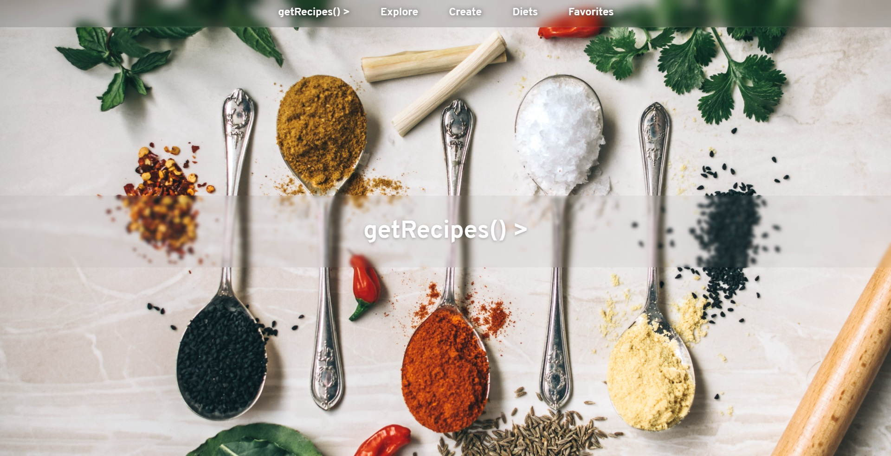
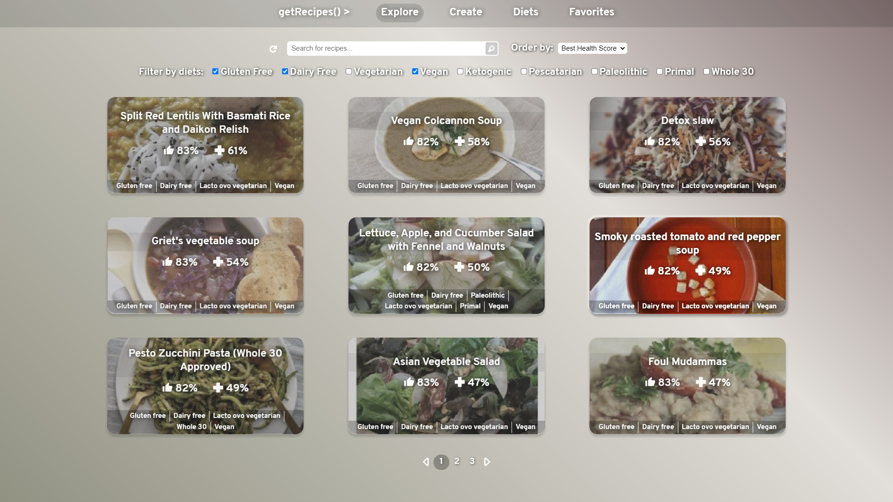
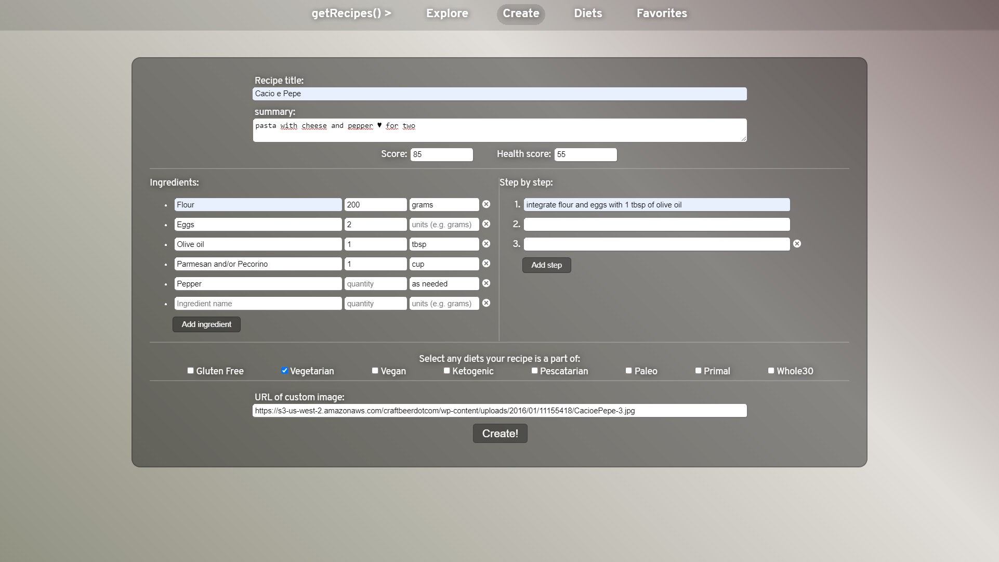
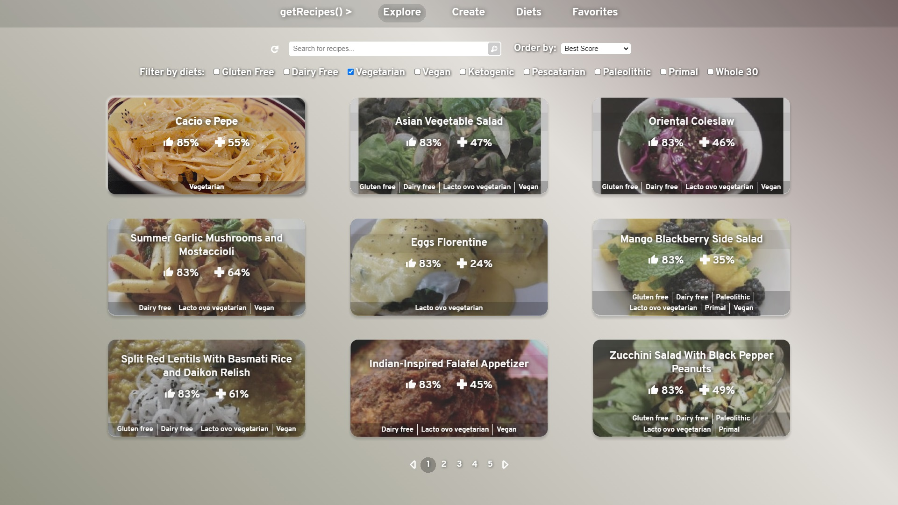
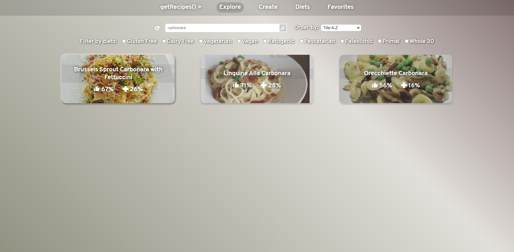
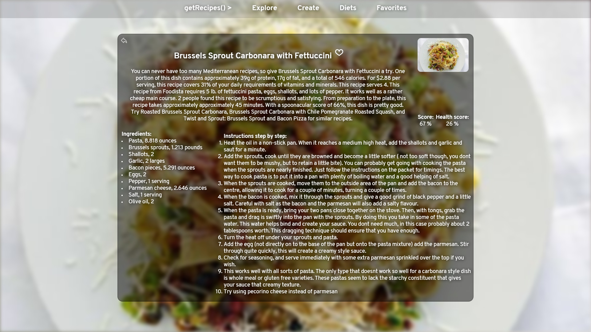
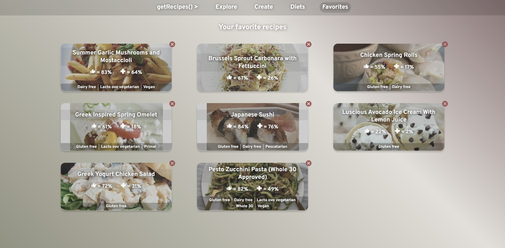
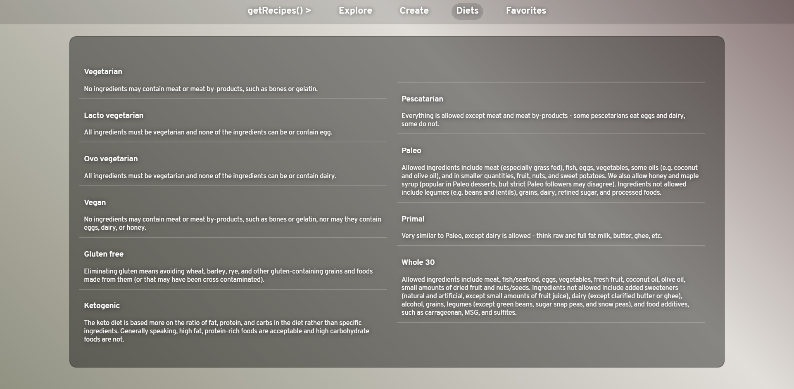

# getRecipes() >

###### this README is in progress

<hr />

### captures

> Landing Page
> 

> Main
> 

> Recipe Creation, for example creating "Cacio e Pepe" recipe
> 
> Once the recipe is created, it is published with the rest of the recipes
> 

> Search Recipes by name
> 

> Details of a recipe
> 

> Your Favorite Recipes
> 

> Description of Diets
> 

<hr />

## Objetivos del Proyecto

- Construir una App utlizando React, Redux, Node y Sequelize.
- Afirmar y conectar los conceptos aprendidos en la carrera.
- Aprender mejores prácticas.
- Aprender y practicar el workflow de GIT.
- Usar y practicar testing.

__IMPORTANTE:__ Es necesario contar minimamente con la última versión estable de Node y NPM. Asegurarse de contar con ella para poder instalar correctamente las dependecias necesarias para correr el proyecto.

Actualmente las versiónes necesarias son:

 * __Node__: 12.18.3 o mayor
 * __NPM__: 6.14.16 o mayor

Para verificar que versión tienen instalada:

> node -v
>
> npm -v

## BoilerPlate

El boilerplate cuenta con dos carpetas: `api` y `client`. En estas carpetas estará el código del back-end y el front-end respectivamente.

En `api` crear un archivo llamado: `.env` que tenga la siguiente forma:

```
DB_USER=usuariodepostgres
DB_PASSWORD=passwordDePostgres
DB_HOST=localhost
```

Reemplazar `usuariodepostgres` y `passwordDePostgres` con tus propias credenciales para conectarte a postgres. Este archivo va ser ignorado en la subida a github, ya que contiene información sensible (las credenciales).

Adicionalmente será necesario que creen desde psql una base de datos llamada `food`

El contenido de `client` fue creado usando: Create React App.

## Enunciado

La idea general es crear una aplicación en la cual se puedan ver distintas recetas de comida junto con información relevante de las mismas utilizando la api externa [spoonacular](https://spoonacular.com/food-api) y a partir de ella poder, entre otras cosas:

  - Buscar recetas
  - Filtrarlos / Ordenarlos
  - Crear nuevas recetas propias
